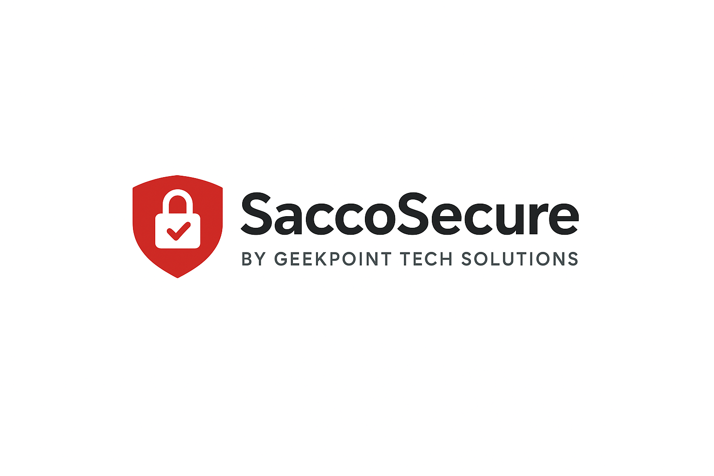

# SaccoSecure Alarm Monitoring App

## Table of Contents

-   [Project Description](#project-description)
-   [Features](#features)
-   [UI/UX Design](#uiux-design)
-   [Technical Details](#technical-details)
-   [Folder Tree](#folder-tree)
-   [Getting Started](#getting-started)
-   [Testing](#testing)
-   [License](#license)
-   [Author(s)](#authors)
-   [Documentation](#documentation)

## Project Description

SaccoSecure is a security-focused mobile application designed for offline-first alarm monitoring. It provides a secure platform for managing alarm events, tracking compliance, and generating reports. The app emphasizes security, reliability, and a user-friendly interface.

## Features

-   **Offline-first Architecture:** Leverages a local SQLite database for data storage, ensuring functionality even without internet connectivity.
-   **Multi-user Authentication:** Supports secure multi-user login with optional biometric authentication (fingerprint).
-   **SMS Event Parsing:** Processes incoming SMS messages to extract and classify alarm events based on predefined rules.
-   **Automated Daily Summaries:** Schedules and sends daily notifications summarizing trouble events from the previous day.
-   **PDF Report Generation:** Allows users to generate detailed PDF reports for specific branches and time periods.
-   **Real-time Notifications:** Provides immediate UI notifications for critical alarm and tamper events.
-   **Theming:** Supports both light and dark themes for personalized user experience.

## UI/UX Design

SaccoSecure is built with a focus on a clean, intuitive, and visually appealing user interface, following Material Design principles. Recent UI/UX enhancements include:

-   **Animated Loading Screen:** A professional and themed loading screen with a fading and scaling logo animation, providing a smooth app startup experience.
-   **Enhanced Dashboard:** The dashboard provides a clear overview of recent activity and key statistics with improved layout, consistent typography using the app's theme, and better spacing.
-   **Consistent Theming:** The app consistently applies the defined theme for colors, typography, and component styles across different screens.

## Technical Details

-   **Framework:** Flutter
-   **Local Database:** SQLite
-   **State Management:** Provider
-   **SMS Handling:** using `another_telephony` package for Android (Note: iOS support for direct SMS handling is limited and may require alternative approaches or native code).
-   **Notifications:** Local notifications using `flutter_local_notifications`.
-   **Background Tasks:** Scheduled tasks using `workmanager`.
-   **PDF Generation:** using `pdf` package.
-   **Logging:** Structured logging using `dart:developer`.
-   **Architecture:** (Describe your app's architecture, e.g., layered architecture with separation of concerns for UI, business logic, and data).

## Folder Tree
. ├── android/ ├── ios/ ├── lib/ │ ├── assets/ │ │ └── images/ │ │ └── logo.png │ ├── core/ │ │ ├── db/ │ │ ├── dao/ │ │ ├── models/ │ │ ├── services/ │ │ └── util/ │ ├── db/ │ │ └── models/ │ ├── ui/ │ │ ├── screens/ │ │ └── widgets/ │ └── main.dart ├── sacco_secure/ (Assuming this is a separate project) │ ├── android/ │ ├── ios/ │ ├── lib/ │ └── pubspec.yaml ├── test/ │ └── widget_test.dart ├── .idx/ ├── .vscode/ ├── analysis_options.yaml ├── blueprint.md ├── GEMINI.md ├── pubspec.lock ├── pubspec.yaml └── README.md
*(This folder tree is a simplified representation. You can adjust it to accurately reflect your project's structure.)*

## Getting Started

To set up and run the SaccoSecure app locally, follow these steps:

1.  **Clone the repository:**
2.  **Navigate to the project directory:**
3.  **Get dependencies:**
4.  **Run the app:**

### Prerequisites

-   Flutter SDK installed and configured.
-   Android Studio or VS Code with Flutter and Dart plugins.
-   An Android device or emulator for testing SMS and native features.

## Testing
-   **Widget Tests:** Located in the `test` directory. Run using `flutter test`.

## License

This project is private and all rights are reserved. Unauthorized use, distribution, or modification is prohibited.

© 2025 Ngigi dennis Geekpoint Tech Solution

## Author(s)

-   Ngigi dennis Geekpoint Tech Solution (Link to your website or GitHub profile)

## Documentation

For detailed documentation on the project's internal workings, design decisions, and development progress, please refer to the [blueprint documentation](blueprint.md).
